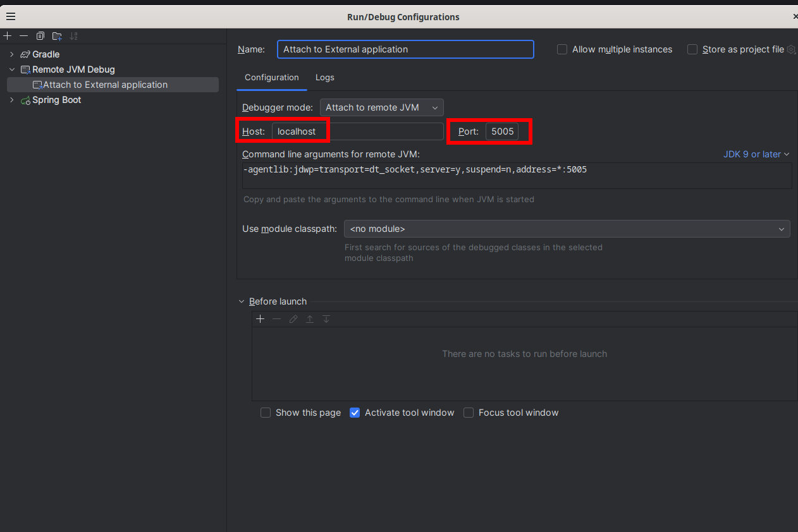

# Summary

- [Introduction](#Introduction)
- [Generate the build zip](#generate-the-build-zip)
- [Templates](#Templates)
- [Attaching a debugger](#attaching-a-debugger)
- [Running a lambda](#running-a-lambda)
- [Invoking Lambdas](#invoking-lambdas)
    + [Generate a SQS event](#generate-a-sqs-event)
    + [Generate HTTP Event](#generate-http-event)

# Introduction

This repository contains helper files to run lambdas locally thought AWS **sam**.   

- [SAM local Parameters](https://docs.aws.amazon.com/serverless-application-model/latest/developerguide/sam-cli-command-reference-sam-local-start-api.html)
- [Invoke Local Lambdas from applications](https://github.com/aws/aws-sam-cli/issues/260)

Make sure to have **sam** installed.

# Generate the build zip

Its good if we can define the same name always. 
This means that we wouldnt need to change the **CodeUri** everytime that we generate a new version of your lambdas.

We can add this to `gradle.build` file, to make sure that the `buildZip` task will generate a file called `code.zip`
```java
task buildZip(type: Zip) {
    archiveFileName.set("code.zip")
    from compileJava
    from processResources
    into('lib') {
        from configurations.runtimeClasspath
    }
}
```

> This is not mandatory, but please, just make sure to always point to the correct zip files.   

# Templates

You can define any number of lambdas that you wanna have.  
Just pay attention to the lambda names, since its by the name that you define that you will reference it.

# Attaching a debugger

You will need a debugger that can debug code that you used to built the lambda.  
For example, if created java lambdas, you can use IntelliJ to attach to an external process.  
But first, make sure to start the lambda.    


> Make sure that you use the same port on **`template.yml`** file.

# Running a lambda

You can just run start-lambda.sh and invoke the lambda.    
This will make the lambda open to listen to events.

# Invoking Lambdas

All that we need, is the **lambda name** and the **events**.   
The events are not mandatory. For example, we might have a lambda that just runs something that does not depend of an external event.

I.e: `/invoke.sh mylambda_name_defined_in_template.yml --event events.json`

- ## Generate a SQS event

`sam local generate-event sqs receive-message > events.json`     
./invoke.sh <lambda that listens for a sqs> --event events.json

- ## Generate HTTP Event

`sam local generate-event apigateway http-api-proxy > events.json`     
./invoke.sh <lambda that wakes up on an http request> --event events.json

